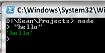
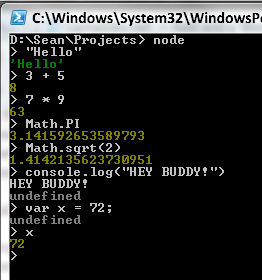
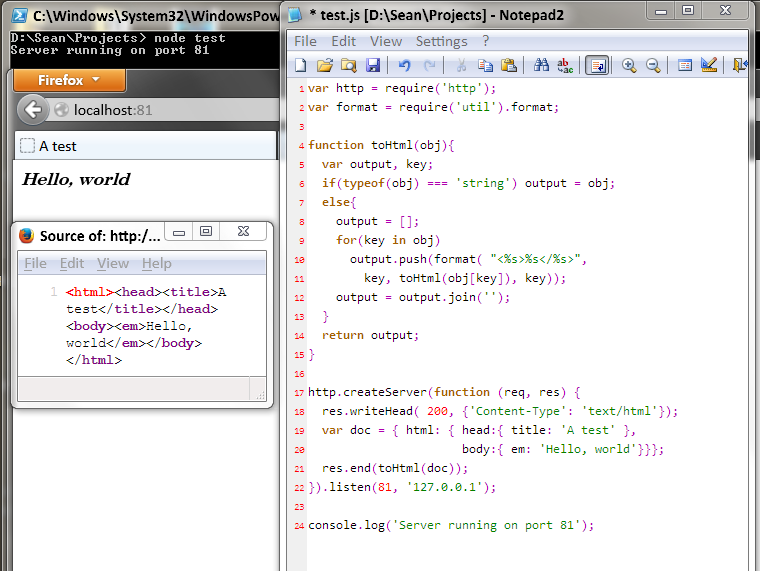

I had been hearing about Node.JS for a while. "It's JavaScript on the server!" I mostly ignored it, as ASP.NET was forced on me at the time and I hadn't yet given employed life the finger and a flaming bag of poo on its doorstep[1]. What does "JavaScript on the server" even mean?

Well, it's a little more than just the bare meaning of a JS execution environment outside of a browser. Think of it like JS finally making something out of itself. All those years in college. Getting stuck in low paying design jobs. Now it commands respect! It can connect to databases!

Basically, start with V8--Google's JavaScript engine, not the salty-disgusting-juice that tricks you into eating vegetables when you were expecting a fruit smoothy instead. Just like the JavaScript that runs in their Chrome web browser. Then, throw away DOM--or rather--never add it because you didn't add WebKit into the sauce. Finally--and here comes the important part--throw on top a reliable package manager and a core set of libraries that make building a stand-alone Web server nothing more than a few lines of configuration code.

I should probably just shut up now and get to the point, because I'm the one late to the party and you, dear reader, probably know all this junk already.

What kept me away for so long was Django. And Ruby On Rails. And Leinenkugel, or Lemonysnickets, or whatever the hell those people in ScalaClosureClojure land are calling it. See, I have been trying for many years to get out of ASP.NET, and having heard the call of all of these programming-language-plus-web-environment-plus-package-manager combos[2], I had tried them out, to much dismay. These things were a pain in the ass! This was what everyone on HackerNews was raving about and telling me I was the idiot for sticking to ASP.NET? Half this junk wouldn't run on Windows without at least a day and a half of tracking down obscure patches and packages and talismans, of which you're on your own finding because the communities are hostile towards Windows users. Yes, I know, you don't like "Micro$oft". But not helping me and not spending the extra effort to make your software compatible with Windows, you're also not helping me get one step closer to using Linux full-time.

But Node.JS isn't like that.

First of all, you install one thing. You go to http://nodejs.org/download/ and you pick the version that is right for your system. Or, you open your terminal and type "apt-get install nodejs" or "emerge nodejs" or "yum install npm" or "brew install node" or whatever, you can probably figure it out, it's out there in your package manager of choice. And it's done. You have it. It's even installed on your PATH now.

Next, you don't "django-admin.py startproject mysite" or "rails new mysite" and then watch as it does a ton of stuff that nobody has explained yet and aren't anywhere close to explaining, because apparently you should be happy that it just dumped half a megabyte of text on your hard drive when all you want to do is give the thing a spin. If you want someone to make a project template for you later, you can do that, but up front, when you're just trying it out, there is no necessity.

And finally, when you install new libraries through the package manager, NPM, you also don't go hunting for obscure C libraries that maybe didn't get included in your particular Linux distro because the package maintainer is a masochist who compiled his own Gentoo from scratch and you're on a base config of Linux Mint, or because you're on Windows still and would really rather not have to install that bastard child Cygwin.

So let's try it out now. Open your command line. Type "node". Hit enter. I'll wait. If you installed it like I said, it should work. They realized people don't like to take more than one step to use new software, so they setup reasonable defaults for everything. You'll be presented with a REPL[3]. Then, just type sometimg. Sometimes I type "hello", a methaphorical call out into the dark, searching for a response. It comes in the form of evaluation.

Try a few more things, quit out of it by hitting CTRL+C twice[4].

If you've ever done anything with the HTML, this is probably no big surprise. And that's the brilliance of Node.JS! It's a programming language you already know.

Okay, one more example, to show off how easy it is to get a Web server going, because REPLs are great and all but they don't a project make. Particularly clever students with well refined bullshitting skills will find everything they need in the next screenshot to make a successful consultancy. If you've never done web development before, you have no clue how much I didn't have to do here. This is not a specially contrived example with 10MB of configuration files in a Turing-complete config format. I did this from a bare install as I described in the article and you see everything in this image necessary to replicate it.

That's it for now. Stay tuned for my next article, which will cover WebSockets with AJAX fall-back through Socket.IO. What does that even mean!? LOLGIBBERISH! It means lower overhead for requests back to the server, which means faster updates from the server, which means we can start writing networked games in JavaScript and deploy them through the browser in a way that Java never seemed to be able to pull off.

[1] for the record, I still haven't, but I have stopped returning its calls.
[2] the good, ol' PLPWEPPMC, as my pappy used to call it
[3] Read-Eval-Print-Loop, a new brand of cereal to compete with Fruit-Loops
[4] or CMD+C on OS X, but I suspect you probably know to make the mental translation on your own by now