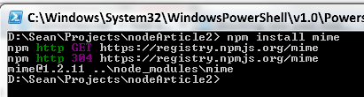
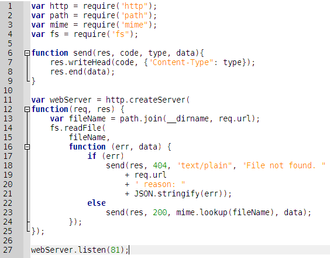
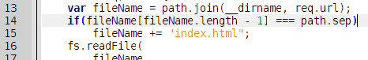
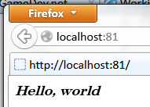
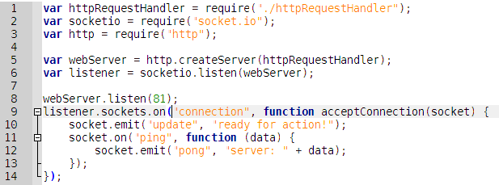
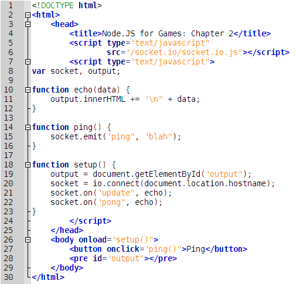
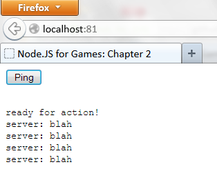

Yesterday, I talked about how easy it is to get Node.JS installed, regardless of your platform, and get code running that shows something in your browser. Whether you're on Windows or OS X or Linux, there is only one package to install that gives you access to an easy-to-configure web server running in a language you probably already know: JavaScript.

Today, we're going to jump feet first into Socket.IO: an library for Node.JS that supports WebSockets[1] between your server-side code and your client-side code, all the way back to IE5.5. Yeah[2].

To start, we'll need a basic web server that can load static files and send them to the user. I'm jumping ahead here and assuming that I'm going to eventually want to serve up some HTML, CSS, client-side JavaScript, PNG, and MP3 files, considering the goal is to make a game here. That's a lot of different types of content, so I'm going to cheat and take a library someone else wrote for handling it: Mime. This will also give me a chance to show you what happens when you install a dependency through NPM.

I'm going to make a new directory for a project, then install the Mime library through NPM. I'm making a new directory because NPM is going to download some files for me and I want it to stick them somewhere that won't junk up my harddrive. Installing the library is just simple "npm install mime" statement.



And there it goes. NPM knows where to download the code for Mime because someone registered Mime on the NPM website. The library gets copied to a directory called node_modules.

Now, let's throw down some code into a text file:



I hope this is pretty clear on what it does. There is not a lot to cover. Probably the most surprising part of it is the http.createServer call. It's registering a callback function that will be called whenever an HTTP request is made to the server. In general, Node.JS does a lot of stuff through callbacks, to make up for its lack of multi-threading primitives of any type. It's basic HTTP from there. I save this to a file called "server.js" and run it with a simple "node server" (Node adds the ".js" file extension for me), I open my browser and head over the http://localhost:81/ and this is what I get:

````
File not found. / reason: {"errno":28,"code":"EISDIR"}
````

Aaaah, yes, I didn't actually tell it what file I want. That's pretty easy to fix though. Let's kill the server with CTRL+C (webServer.listen will keep Node running until we explicitly kill it) and make the code default to loading an "index.html" file if the URL specified indicates it was a directory name.



I've also created a file named "index.html" that just contains the text "<em>Hello, world!</em>". Now, when I restart the server and load the page, I see this:



"But capn_midnight", you say, "Why don't we just use Express and weeooeeooeeeoooooo". Because we're making a Single-Page Application (SPA) that will have mostly static files for making an extremely basic front end, with most of the logic residing on the server side. If we need more out of our static content delivery than this, then we can figure that out later. Also, this article series isn't really about Node.JS or Socket.IO or Express or any thing in particular, it's about getting to make a multiplayer game very quickly.

Alright, let's move on to the Socket.IO stuff. Do yourself an "npm install socket.io" in your project directory. You'll notice that there is a lot more spewed out than when we did it for Mime. This is because Socket.IO has its own dependencies and NPM went ahead and got them for us. If you've done any reading about NPM installs, you might ask if we would want to install Socket.IO with the -g switch, for "global". Typically, global installs are for installing Node software that we are going to use, not libraries that our project is going to use. If we wanted to use the TypeScript translator, that would be done with "npm install -g typescript" (and you would have to have admin rights, so you probably need to sudo that if you're on a Unix-like OS). Then, we would have the TypeScript compiler, tsc, installed into our PATH, and we could use it directly from the command line. But that's not necessary here.

For code, I'm going to first push most of the Web server stuff into it's own file, just to try to keep everything tidy. The only thing left in my original source file is the call to create the server and start listening. It's important at this point to point out a point of interest in Node's import system. When you call the require() function, the parameter to it is actually specifying a search string, not exactly a library. It iteratively searches from the current directory all the way up to the root directory of your system, looking for a "node_modules" folder that has a file that matches the name you're looking for. And if you didn't add a file extension to the file, require() automatically assumes ".js" for you.

But, if you don't want to put your files into a folder named "node_modules" (or pollute your NPM installation directory), then you need to tell require to look in a specific directory for the file. It's a lot simpler than it sounds, just use the "." single-dot name for the "current directory" and apply your filename to that.

So in this particular case, I've moved my code to a file named "httpRequestHandler.js". I've put it in the same directory as my "server.js" file. So to import it, I must "require('./httpRequestHandler.js')" or "require('./httpRequestHandler')" for a little-bit shorter version.

Anyway, now that we've had that little bit of a side-quest, back to the task at hand. I add code to my server.js file for creating a WebSockets listener. It's very simple. If you've done any sort of network programming before, I'm sure you'll be as flabbergasted as I was.



Look at that! It's all of four additional lines of code to listen, respond to new connections, and do some basic communication. In other words, it's one more freaking line of code than things we're freaking doing.

So what is going on here? Well, lines 5 and 6 get our web server going again, to be able to serve up the index.html file that will represent the client side of our client-server modeled program. And lines 8 through 14 setup the server side of our client-server modeled program.
* Line 8: Socket.IO needs to know what socket it's going to listen on. You can give it a specific port number, or you can give it a reference to your webServer object and it will listen on the same port as the Web server is running on. That's pretty neat.
* Line 9: Registers a callback function that will execute whenever a new connection is made. At this point, we're officially ready-and-waiting for connections. The callback receives a parameter that is the socket object with which we'll communicate with the connected client. No polling for new connections, no needing to worry that work done to accept a connection is blocking IO with all of the other clients. It's the very picture of "just works".
* Line 10: To send data to the client, we use the emit() method on the socket object. It takes two parameters, an event name and a data package to include with the event. The names can be anything of your choosing. Any event issued with emit() can be consumed with on(). The data package can be anything as well. Typically, we'll send a plain Javascript object, but for now I'm just sending a string.
* Line 11: To receive data from the client, we use the on() method on the socket object. It takes two parameters, an event name and a callback function to execute when the event occurs. The callback function receives a parameter of its own, which will be the data package that was emit()ed at the server from the client.
* Line 12: And then, for this example, just to prove to the client that we heard it, we echo back a message.

Finally, we need a little bit of UI code to provide a user a physical interface with which to interact with server:



By now, there shouldn't be anything surprising here. We using an HTML SCRIPT tag to import the Socket.IO library for the client side[3]. It specifies an object called "io" that has a method connect(). Connect takes an address and does all the handshaking necessary to establish a connection[4]. From there, it's exactly the same as wiring up the events and handlers as we did on the server side. *Exactly the same*. Networking code really can't get any simpler than this.

Start it up, click the button a few times, and you should see this:



By this point, if you know HTML, CSS, and JavaScript already, you can be off to the races on making a multiplayer game with Node.JS and Socket.IO. But I'm not going to leave you out in the rain just yet. Next time[5], I'll show you a very simple chat program using what we've learned so far. And this very simple chat program will grow legs and eventually become a Multi-User Dungeon, or MUD for short.


[1] strictly speaking, it's only WebSockets if you're on a browser that supports WebSockets, but they smooth over the details for you with some fallback options. By default, you probably won't have to worry about it.
[2] I know. Sploosh. Okay, the IE5.5 support isn't that mind blowing considering that it's done through a Flash plugin. But it points to a larger issue of dedication to cross-platform compatability in the Socket.IO dev team. This works whether you're on a 3 year old iPhone or a 10 year old laptop. In other words, if your code has platform compatability issues, it's probably not Socket.IO.
[3] The location of which is a closely guarded secret. Actually, it's just coming out of your node_modules directory. But Socket.IO is hijacking the HTTP requests a little bit to look for requests to the client JS file. Anyway, this is mostly out of scope here.
[4] There is a seriously heavy amount of code in this connect() method. It has to figure out what the client browser is capable of doing, be it true WebSockets, AJAX long-polling, or eventually just giving up and using a Flash-based fallback. And then it has to make the connection to the server and communicate those details so that the server knows how to respond. Again, not really that important.
[5] Which unfortunately might be a couple of weeks. I'm going on a two-week-long trip to the Galapagos Islands with my wife, my camera, and distinctly *not* my computer.